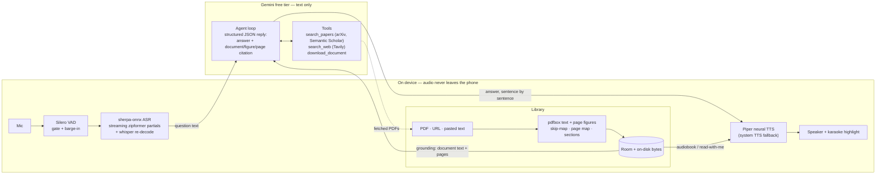

# LearnAnywhere

A hands-free Android study companion: build a library of documents, talk to it, and have it read them to you.

Tired of staring at a paper, or typing prompts into a chat window just to
understand one? LearnAnywhere lets you collect the documents you care about,
ask about them out loud, and treat any of them as an audiobook. Good for a
commute, for reading with a visual impairment, and for chasing down the
references in a paper without losing your place.

What works today:

- **Ask by voice.** Speech recognition runs on the phone; answers come back
  spoken. Speak while it's talking and it stops and listens (on-device VAD).
- **A library you assemble.** Add a PDF, a URL, or pasted text. PDFs get their
  text layer extracted and their pages rendered as figures.
- **Grounded answers.** Replies cite the document, the figure, and the page —
  and the cited page renders as a tappable thumbnail.
- **Audiobook mode.** Any document, read end to end, with a speed control that
  persists.
- **Read-with-me.** Guided section-by-section reading with karaoke sentence
  highlighting and the matching page beside the text; interrupt with a question
  and reading resumes where it left off.
- **Silent boilerplate skipping.** References, license blocks, arXiv stamps and
  acknowledgements are skipped when reading aloud, via a skip-map sidecar (an
  LLM pass at add time, regex heuristics as floor and ceiling). The stored text
  is never mutated — Q&A still sees the whole document.
- **Voice seek.** "Drop me in the part about positional encoding" jumps reading
  to that section.
- **It finds papers for you.** The agent can search arXiv and Semantic Scholar,
  search the web (Tavily), and download a PDF straight into your library.
- **Swipe** between Home and your saved sessions; **Android Auto** lists your
  library as a media app.
- **Free tier only.** Bring your own Gemini API key (no credit card); the
  Tavily key for web search is optional.

Honest scope: this is a personal project. Android 14+ only, it needs a free
Gemini API key to do anything with the agent, and scanned image-only PDFs have
no text layer, so they can be discussed but not read aloud.

## Design

### The gap

Each half of this already exists, and neither half talks to the other.

Audiobook and TTS apps read books, not *your* PDFs — and they have no idea what
the paper says, so they can't answer a question about it. Notebook and RAG
tools will answer questions about your documents, but they are a screen and a
keyboard: not something you can use with your hands on a steering wheel. Voice
assistants are hands-free but they ship your raw audio to a cloud provider and
know nothing about your library.

So the target is the intersection: **entirely vocal interaction**, grounded in
documents *you* chose, with the screen acting as a mirror — the sentence being
spoken, the figure being cited — for when you can glance at it. Two constraints
shape every decision (DESIGN.md §1):

1. **Free.** Free API tiers only, no paid keys, no subscriptions.
2. **Voice privacy.** Raw microphone audio never leaves the device — not to
   Google, not to anyone. Speech recognition and speech synthesis both run
   locally. Document *text* is a separate and weaker constraint: it does go to
   Gemini, and on the unpaid tier outside the EEA/UK/Switzerland Google may use
   prompts and attached documents for training, with possible human review.
   Fine for arXiv papers; use a paid key for anything sensitive.

That second constraint is why Gemini's free native-audio input is deliberately
unused, and why speech is a local dependency rather than a cloud call.

### How it fits together

Notes on the pieces:

- **Speech in and out** are one dependency: the sherpa-onnx AAR provides Silero
  VAD, a streaming zipformer for live partials, a whisper second pass for
  accuracy, and the Piper voice. Models are fetched by a script, not committed.
- **The agent loop** is hand-rolled against the Gemini REST API — no agent
  framework in the APK. Replies come back as structured JSON so the
  citation and the seek target are fields, not regex bait. The tool loop has a
  hard iteration cap, returns tool failures to the model rather than throwing,
  and validates any URL the model asks it to fetch.
- **Requests are laid out for the free tier**: the prefix (system prompt,
  grounding, history) stays byte-stable turn over turn so Gemini's implicit
  cache hits, documents upload once via the Files API, and per-turn context
  rides late in the request instead of in the system instruction.
- **The library is the grounding set**, and the same extracted text feeds
  playback directly — audiobook and read-with-me never touch the network.

`DESIGN.md` is the source of truth for the reasoning and the decisions log;
`STATUS.md` is the honest current state, including what is and isn't verified
on a real device.

## Plans for the future

- **Continuous listening.** Voice input is push-to-talk today; VAD-gated
  always-on listening needs a mic foreground service.
- **Barge-in tuning.** It still occasionally triggers on the phone's own TTS —
  a VAD-threshold and echo-cancellation pass, per device.
- **Android Auto figure art** via MediaSession metadata, so the cited page
  shows on the head unit. Deferred until it can be tested in a real car.
- **Dual-channel replies** if the current single spoken-and-shown answer proves
  too bare on screen — the decision was deliberately to try one channel first.
- **A privacy-respecting fallback provider** (Groq's free tier does not train
  on inputs), for documents that shouldn't go to the Gemini free tier.
- **Vector-native figure extraction.** Figures are page-level renders scored by
  a heuristic; real extraction needs a PDF-native pass. OCR for scanned PDFs
  is the related gap.
- **Interactions API migration** and a framework (Koog) if the agent outgrows a
  hand-rolled loop — both intentionally deferred while the loop stays small.

## Contributing

Open an issue to discuss what you have in mind, then send a PR.

To build you need the Android 14 SDK (compileSdk 34, minSdk 34) and JDK 17.
The speech binaries — sherpa-onnx AAR, ASR models, Silero VAD, the Piper voice
— are gitignored, so run `scripts/fetch_speech_assets.sh` once after cloning,
then `./gradlew :app:assembleDebug`. `./gradlew :app:testDebugUnitTest` runs
the JVM tests and needs no device. A free Gemini API key goes in Settings
(Tavily's is optional, for web search).
